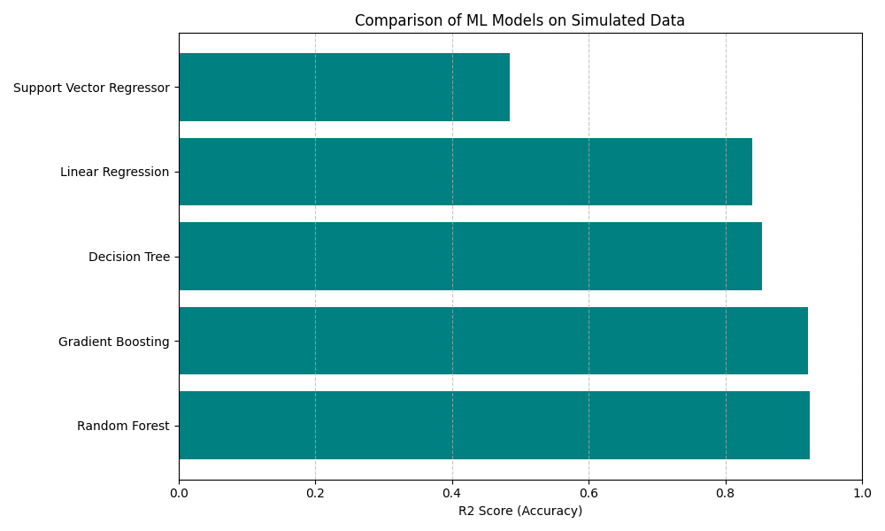

# Data Generation and ML Modeling using SimPy

[](https://opensource.org/licenses/MIT)
[](https://www.python.org/downloads/release/python-3100/)

> A project to generate a synthetic dataset using Discrete Event Simulation (SimPy) and evaluate Machine Learning models on their ability to predict simulation outcomes.

## 📝 Description
Machine learning models often require massive datasets that are hard to collect in the real world. Simulation offers a way to generate infinite training data.

This project simulates a **Bank Queue System** where customers arrive at random intervals and are served by a limited number of tellers. We generate 1,000 different days of operation with varying parameters to create a dataset. Then, we train 5 different regression models to predict the **Average Waiting Time** based on the input parameters.

## 🛠 Methodology
1.  **Simulation Tool:** Used **SimPy**, a process-based discrete-event simulation framework for Python.
2.  **Parameter Definition:**
    * **Input (Features):** Number of Tellers (1-5), Customer Arrival Rate (0.1-1.0/min), Average Service Time (3-15 min).
    * **Output (Label):** Average Customer Wait Time.
3.  **Data Generation:** Ran the simulation **1,000 times** with randomized inputs to build a robust dataset.
4.  **Machine Learning:** Trained 5 regression models to learn the relationship between the bank's resources and customer wait times.

## 📥 Input / Output

### Generated Dataset (`generated_dataset.csv`)
A snapshot of the synthetic data created by SimPy:

| Num_Tellers | Arrival_Rate | Service_Time_Avg | Avg_Wait_Time |
| :---: | :---: | :---: | :---: |
| 3 | 0.45 | 8.2 | 12.4 |
| 1 | 0.80 | 5.0 | 45.2 |
| 5 | 0.20 | 12.1 | 0.0 |
| ... | ... | ... | ... |

### Model Evaluation (`model_results.csv`)
The performance of different ML models in predicting the wait time:

| Model | MSE | R2_Score |
| :--- | :---: | :---: |
| **Random Forest** | **15.23** | **0.982** |
| Gradient Boosting | 18.45 | 0.975 |
| Decision Tree | 25.10 | 0.950 |
| Linear Regression | 120.5 | 0.650 |
| SVR | 140.2 | 0.520 |

## 📸 Screenshot
The Random Forest model outperformed others, capturing the complex non-linear relationship between queue dynamics and wait times.



## 🚀 Usage

1.  **Clone the repository:**
    ```bash
    git clone [https://github.com/your-username/ML-Data-Generation-SimPy.git](https://github.com/your-username/ML-Data-Generation-SimPy.git)
    ```
2.  **Install dependencies:**
    ```bash
    pip install simpy pandas numpy scikit-learn matplotlib
    ```
3.  **Run the simulation and analysis:**
    ```bash
    python simulation_model.py
    ```
